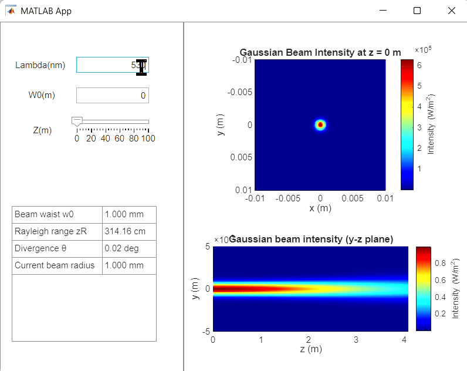

# FSOBeamSim

**FSOBeamSim** is an interactive MATLAB App Designer project for visualizing how a Gaussian laser beam propagates through free space. It serves as an intuitive and educational platform that gradually guides users from fundamental optical beam physics to the basics of free-space optical (FSO) communication.

---

## ✨ Features

### **Interactive Gaussian Beam Simulation**
FSOBeamSim allows users to adjust key beam parameters including beam waist, wavelength, and propagation distance using a slider-driven interface. The app provides **real-time visualization** of beam propagation with two primary visual outputs: an **x–y cross-section** at a chosen propagation distance and a **y–z propagation slice** extending to roughly 1.3× the Rayleigh range. These visualizations highlight fundamental Gaussian beam concepts such as Rayleigh range, beam divergence, and intensity decay, providing an intuitive understanding of how a Gaussian beam spreads as it travels.

---

## 🎥 Demonstration

The animation below demonstrates the **real-time Gaussian beam propagation** in FSOBeamSim. As the sliders are adjusted, users can see how the beam evolves with distance. The x–y cross-section shows the intensity profile at a specific propagation point, while the y–z slice illustrates the overall beam propagation and divergence. This interactive visualization helps users connect parameter changes with beam behavior in an intuitive way.

  

---

## 🔭 Future Development

### **Atmospheric Effects (Planned)**
Future versions will incorporate simplified atmospheric models, including turbulence, temperature gradients, humidity variations, and absorption or attenuation. These effects will demonstrate phenomena such as beam wander, scintillation, and power loss over distance, bringing the simulation closer to real-world FSO conditions.

### **Basic FSO Communication Simulation (Planned)**
Once atmospheric modeling is integrated, the app will allow users to simulate a simple FSO communication link. This will include transmitting a binary or step signal, estimating received optical power, performing threshold-based detection, and visualizing basic BER-style reliability, illustrating how environmental effects impact communication performance.

---

## 🎯 Project Goals

FSOBeamSim aims to provide:
- A beginner-friendly introduction to optical beam behavior  
- A bridge between ideal Gaussian optics and real-world atmospheric effects  
- A compact visualization tool demonstrating essential FSO communication principles  

---

## 🛠 How to Run

1. Open the `.mlapp` file in MATLAB.  
2. Click **Run** in App Designer.  
3. Adjust sliders to explore Gaussian beam propagation in real time.  

---

## 📁 Roadmap

FSOBeamSim is planned to evolve in stages:

1. **Gaussian Beam Propagation (Completed):** Real-time simulation and visualization.  
2. **Atmospheric Effects (In Progress):** Turbulence, absorption, temperature, and humidity modeling.  
3. **Simple FSO Communication (Planned):** Signal transmission, received power estimation, and BER visualization.  
4. **Advanced Features (Future):** Phase-screen turbulence, adaptive optics, and aperture-based detection models.

